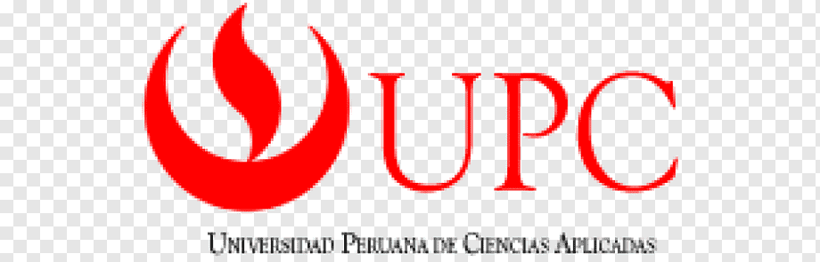
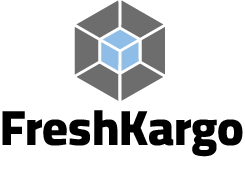

# UNIVERSIDAD PERUANA DE CIENCIAS APLICADAS

{ width=2cm }

**Facultad de Ingeniería**

**Carrera de Ingeniería de Software**

---

**Curso:** Desarrollo de Aplicaciones Open Source  
**Código:** 1ASI0729 | **NRC:** 11848  
**Ciclo:** 2026-10  
**Docente:** Angel Augusto Velasquez Nuñez

---

{ width=4cm }

# INFORME DE TRABAJO FINAL

**Startup:** Fullstack United

**Producto:** FreshKargo

---

## Integrantes del Equipo

<table style="margin: 0 auto; text-align: center;">
  <tr>
    <th style="padding: 4px 12px;">Nombre</th>
    <th style="padding: 4px 12px;">Código</th>
  </tr>
  <tr>
    <td>Riveros Vera, Jennifer Yamilet</td>
    <td>U20241C998</td>
  </tr>
  <tr>
    <td>Saavedra Flores, Rodrigo Andree</td>
    <td>U20241D811</td>
  </tr>
  <tr>
    <td>Becerra Tito, Felix Orlando</td>
    <td>U20211B387</td>
  </tr>
  <tr>
    <td>Velasquez Velasquez, Rodrigo</td>
    <td>U20222074</td>
  </tr>
  <tr>
    <td>Carpio Peña, Josue Francisco</td>
    <td>U20211B387</td>
  </tr>
</table>

---

**Abril, 2026**

