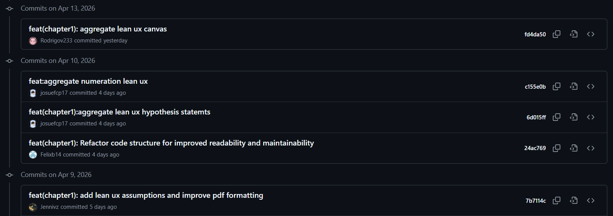

# Project Report Collaboration Insights

El informe del proyecto **FreshKargo** se desarrolla de forma colaborativa mediante el repositorio público de GitHub de la organización **Fullstack United**. Esta sección presenta la forma en que el equipo ha trabajado la elaboración del informe, así como evidencias de colaboración mediante commits y ramas del repositorio.

**Repositorio del informe:**  
https://github.com/fullstack-united-team/freshkargo-report

## Organización del trabajo colaborativo

Para la elaboración del informe se aplicó un flujo de trabajo basado en ramas por capítulo. Esto permitió que cada integrante pudiera avanzar en una sección específica del documento sin afectar directamente el contenido estable del repositorio.

Durante esta primera etapa, el equipo trabajó principalmente con las ramas:

- `main`: rama principal del repositorio.
- `develop`: rama de integración del trabajo del equipo.
- `feature/chapter1`: rama destinada al desarrollo del Capítulo I.
- `feature/chapter2`: rama destinada al desarrollo del Capítulo II.
- `feature/chapter3`: rama destinada al desarrollo del Capítulo III.
- `feature/chapter4`: rama destinada al desarrollo del Capítulo IV.
- `feature/chapter5`: rama destinada al desarrollo del Capítulo V.

El repositorio también fue organizado bajo un enfoque **Docs-as-Code**, separando los archivos Markdown del informe, los recursos gráficos, la configuración de Pandoc y los scripts de compilación.

## Actividades realizadas para la elaboración del informe

Durante el desarrollo de esta versión del informe, el equipo realizó las siguientes actividades:

- Estructuración inicial del repositorio del informe.
- Organización modular del documento mediante archivos Markdown.
- Configuración de carpetas para imágenes, recursos, scripts, archivos de Pandoc y exportación del PDF.
- Desarrollo y mejora del Capítulo I: Introducción.
- Incorporación de Lean UX Assumptions, Lean UX Hypothesis Statements y Lean UX Canvas.
- Actualización de perfiles de integrantes del equipo.
- Desarrollo inicial del Capítulo II: Requirements Elicitation & Analysis.
- Incorporación de análisis competitivo, competidores y Ubiquitous Language.
- Resolución de conflictos de integración entre ramas.
- Mejora progresiva del formato del PDF generado con Pandoc.

## Evidencias de colaboración por integrante

### Felix Orlando Becerra Tito

**Usuario de GitHub:** Felixb14  
**Participación:** Participó en el avance del Capítulo I y en la refactorización de la estructura del informe.

### Josue Francisco Carpio Peña

**Usuario de GitHub:** josefcp17  
**Participación:** Participó en la numeración de Lean UX, Lean UX Hypothesis Statements, competidores y Ubiquitous Language.

### Jennifer Yamilet Riveros Vera

**Usuario de GitHub:** Jennivz  
**Participación:** Incorporó Lean UX Assumptions y apoyó en mejoras de formato del informe.

### Rodrigo Andree Saavedra Flores

**Usuario de GitHub:** rodrigoxd67  
**Participación:** Agregó contenido de Requirements Elicitation para el Capítulo II.

### Rodrigo Velasquez Velasquez

**Usuario de GitHub:** Rodrigov233  
**Participación:** Incorporó Lean UX Canvas y análisis competitivo para el Capítulo II.

## Evidencias visuales del repositorio

A continuación, se presentan capturas del historial de commits del repositorio, donde se evidencia la participación de los integrantes en la elaboración del informe.

{ width=14cm }

## Análisis de colaboración

El historial de commits evidencia que el equipo distribuyó el trabajo entre diferentes integrantes, principalmente en las secciones de los capítulos I y II. Los commits muestran avances progresivos en la documentación del informe, así como ajustes de estructura, contenido y corrección de conflictos.

La colaboración realizada es coherente con el Registro de Versiones del Informe, ya que las modificaciones documentadas en la tabla de versiones se reflejan en el historial de commits y en las ramas utilizadas para el desarrollo del documento.

