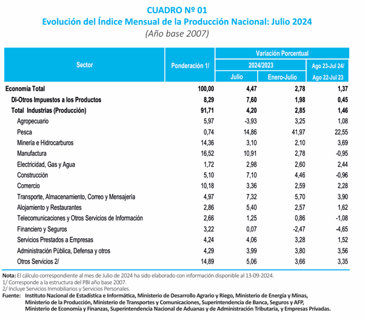
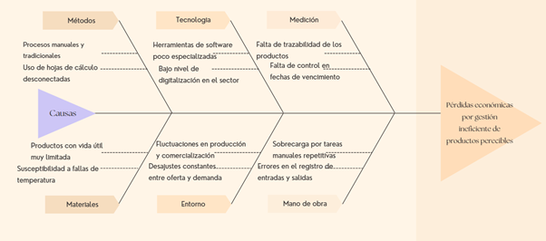

# Capítulo I: Introducción

## 1.1. Startup Profile

### 1.1.1. Descripción de la Startup

FreshKargo es una startup tecnológica peruana dedicada al diseño y desarrollo de soluciones digitales innovadoras para la gestión de inventario y la distribución eficiente de productos perecibles. Nuestra empresa nace con la convicción de que la tecnología puede ser una herramienta clave para reducir pérdidas, optimizar procesos logísticos y mejorar el control de productos sensibles al tiempo.

Creemos en una gestión más eficiente, trazable y automatizada. Por ello, en FreshKargo trabajamos con un enfoque centrado en el usuario, combinando herramientas digitales intuitivas, monitoreo en tiempo real y análisis de datos, para ayudar a empresas del sector alimentario y comercial a tomar decisiones informadas sobre su inventario y distribución.

Nuestro equipo multidisciplinario está comprometido con generar impacto en la industria, aportando valor tanto a distribuidores como a comerciantes, mediante el uso de la tecnología como aliada en la reducción de desperdicios, la mejora de la trazabilidad y la optimización de procesos logísticos.

**Misión:** Optimizar la gestión de inventarios y la distribución de productos perecibles mediante soluciones tecnológicas eficientes y confiables.  

**Visión:** Ser la plataforma líder en la gestión inteligente de inventarios y distribución de productos perecibles a nivel nacional.

### 1.1.2. Perfiles de integrantes del equipo

| Foto | Apellidos y Nombres |
| --- | --- |
|  | **Nombre Apellido - uXXXXXXXX** Descripción del integrante. |
|  | **Nombre Apellido - uXXXXXXXX** Descripción del integrante. |
|  | **Nombre Apellido - uXXXXXXXX** Descripción del integrante. |
|  | **Nombre Apellido - uXXXXXXXX** Descripción del integrante. |
|  | **Nombre Apellido - uXXXXXXXX** Descripción del integrante. |

## 1.2. Solution Profile

En esta sección se describen las características principales de la solución propuesta, así como su propuesta de valor y modelo de monetización.

### Product Description

FreshKargo es una plataforma web orientada a empresas que gestionan productos perecibles, la cual permite controlar inventarios, registrar entradas y salidas de productos, monitorear fechas de vencimiento y optimizar la distribución. Además, ofrece reportes en tiempo real y herramientas de trazabilidad que facilitan la toma de decisiones, reduciendo pérdidas y mejorando la eficiencia operativa.

### 1.2.1. Antecedentes y problemática

La gestión de productos perecibles constituye un aspecto crítico dentro de sectores como el alimentario y comercial, debido a que estos productos poseen una vida útil limitada y requieren un control riguroso durante todas las etapas de la cadena de suministro. Una gestión inadecuada no solo genera pérdidas económicas, sino que también impacta en la eficiencia operativa y en la calidad del servicio ofrecido al cliente. 

En el contexto actual, muchas empresas, especialmente pequeñas y medianas, continúan utilizando procesos manuales o herramientas no especializadas para la administración de inventarios. Esta situación dificulta el control adecuado de variables clave como las fechas de vencimiento, las condiciones de almacenamiento y la rotación del stock. De acuerdo con estudios recientes, una gestión ineficiente de productos perecibles contribuye significativamente al desperdicio de alimentos a lo largo de la cadena de suministro (Bedoya-Perales & Dal’ Magro, 2021).

Asimismo, en economías como la peruana, la actividad comercial y productiva presenta variaciones constantes que influyen directamente en la gestión de inventarios. Según el Instituto Nacional de Estadística e Informática (INEI, 2024), los niveles de producción y comercialización muestran fluctuaciones periódicas, lo que exige a las empresas contar con sistemas más dinámicos y eficientes para la toma de decisiones.

En este contexto, la falta de digitalización y de herramientas tecnológicas adecuadas limita la capacidad de las organizaciones para monitorear en tiempo real su inventario, anticipar pérdidas y optimizar sus procesos logísticos. Esto genera un entorno donde predominan la incertidumbre, los errores operativos y la baja eficiencia en la gestión de productos perecibles.

Figura 1

Evolución del índice mensual de la producción nacional a julio de 2024

El comportamiento variable de la producción y comercialización influye directamente en la gestión de inventarios, generando desajustes entre la oferta y la demanda. Como se observa en el gráfico, estas fluctuaciones pueden incrementar el riesgo de sobrestock o desabastecimiento, afectando especialmente a los productos perecibles (INEI, 2024). 

 

#### Problemáticas identificadas

- Baja visibilidad del inventario en tiempo real  
- Falta de control sobre fechas de vencimiento  
- Pérdidas de productos por deterioro o caducidad  
- Errores en el registro de entradas y salidas  
- Falta de trazabilidad de los productos  

Figura 2

Diagrama de Ishikawa, efecto: Pérdidas económicas por gestión ineficiente de productos perecibles

El diagrama de Ishikawa nos deja algo muy claro: el problema de las pérdidas económicas tiene varias raíces, sobre todo por la falta de tecnología adecuada y el uso de métodos tradicionales. Para dejar de ver este problema solo en teoría y entender su impacto real en las operaciones diarias de las empresas, vamos a desglosarlo paso a paso con la técnica de las 5 'W's y 2 'H's 

### Técnica de las 5 ‘W’s y 2 ‘H’s

**What?**

**¿Cuál es el problema?** Las empresas que gestionan productos perecibles tienen dificultades para llevar un buen control de su inventario. Esto termina generando pérdidas y afecta la eficiencia en sus productos.

**¿Cuál es la relación con el usuario?** Este problema impacta directamente en sus ingresos, en cómo manejan su día a día y en su capacidad para mantener un buen abastecimiento.

La gestión de productos perecibles presenta diversas dificultades relacionadas principalmente con el control del inventario y el seguimiento de los productos. En muchas empresas, estos procesos todavía se realizan de manera manual o con herramientas poco especializadas, lo que genera desorden en la información y dificulta el control adecuado de aspectos clave como las fechas de vencimiento.

Como consecuencia, es común que se produzcan pérdidas por productos vencidos o deteriorados, además de una baja eficiencia en la rotación del stock. Esta situación también afecta la capacidad de respuesta de las empresas, ya que no cuentan con información actualizada en tiempo real para tomar decisiones. En este sentido, la FAO (2019) señala que una parte importante de los alimentos se pierde a lo largo de la cadena de suministro, muchas veces debido a problemas en la gestión y almacenamiento.

**When?**

**¿Cuándo ocurre?** Principalmente en la gestión diaria del inventario, por ejemplo, al registrar productos, controlar fechas de vencimiento o al momento de planificar la distribución.

**¿Cuándo usa el producto?** A lo largo de toda la jornada laboral, desde que se reciben los productos, pasando por el control del stock, hasta el despacho.

Este problema se presenta de forma continua durante las actividades diarias relacionadas con la gestión del inventario. Por ejemplo, ocurre al momento de registrar productos, controlar su estado o verificar sus fechas de vencimiento, especialmente cuando estas tareas se realizan manualmente.

Además, la situación se vuelve más evidente en momentos de mayor carga operativa, como durante el abastecimiento de productos o en periodos de alta demanda. En estos casos, la falta de herramientas adecuadas puede provocar errores en los registros, retrasos en los procesos y una menor capacidad para reaccionar ante posibles problemas en el inventario.

**Where?**

**¿Dónde ocurre?** En almacenes, centros de distribución, tiendas y puntos de venta.

La problemática se desarrolla en espacios donde se manejan productos perecibles, como almacenes, centros de distribución, supermercados y otros puntos de venta. Estos entornos requieren un control constante debido a la naturaleza de los productos, los cuales pueden deteriorarse rápidamente si no se gestionan adecuadamente.

En el contexto de América Latina, muchas empresas aún dependen de procesos tradicionales y herramientas poco integradas. De acuerdo con EY Perú (2025), esta falta de digitalización limita la eficiencia operativa y dificulta la gestión adecuada de la información dentro de las organizaciones.

**Who?**

**¿Quiénes están involucrados?** Empresas distribuidoras, comerciantes mayoristas y minoristas.

Los principales afectados son las empresas que trabajan con productos perecibles, ya que enfrentan pérdidas económicas cuando no logran controlar adecuadamente su inventario. Estas pérdidas impactan directamente en su rentabilidad y en la eficiencia de sus operaciones.

Asimismo, el personal encargado del manejo del inventario también se ve afectado, debido a la carga de trabajo que implica realizar procesos manuales y repetitivos. Esto incrementa la probabilidad de errores y reduce la productividad. Finalmente, los clientes también pueden verse perjudicados, ya sea por la falta de productos disponibles o por la recepción de productos en mal estado.

**Why?**

**¿Por qué ocurre?** Principalmente por la falta de herramientas digitales adecuadas, el uso de procesos manuales y un bajo nivel de digitalización.

El problema persiste principalmente por la falta de implementación de herramientas tecnológicas adecuadas para la gestión de inventarios. Muchas empresas continúan utilizando métodos manuales o sistemas que no están diseñados específicamente para productos perecibles, lo que limita el control y la visibilidad de la información.

A esto se suma la baja adopción de procesos de digitalización y, en algunos casos, la falta de capacitación del personal en el uso de nuevas tecnologías. Todo esto genera procesos ineficientes, errores en los registros y dificultades para tomar decisiones basadas en datos confiables.

**How?**

**¿Cómo usan el producto?** A través de una plataforma web fácil de usar, que les permite gestionar tanto el inventario como la distribución de forma más sencilla.

El problema se manifiesta a través del uso de prácticas tradicionales, como el registro manual de productos o el uso de hojas de cálculo que no están conectadas entre sí. Esto dificulta el seguimiento adecuado del inventario y hace más complejo el control de aspectos importantes como las fechas de vencimiento.

Además, el personal debe invertir más tiempo en tareas repetitivas, como verificar el stock o actualizar información, lo que retrasa otros procesos importantes. Como resultado, la información disponible suele estar incompleta o desactualizada, lo que afecta la toma de decisiones dentro de la empresa.

**How much?**

**¿Cuánto impacta?** Genera pérdidas económicas, desperdicio de productos y hace que las empresas sean menos competitivas en el mercado.

El impacto de esta problemática es considerable, especialmente en términos económicos. Las pérdidas por productos vencidos o deteriorados pueden representar un porcentaje importante del inventario total, afectando directamente la rentabilidad de las empresas.

Según la FAO (2019), una cantidad significativa de alimentos se pierde durante las etapas de almacenamiento y distribución, lo que evidencia la magnitud del problema. Además, el uso de procesos manuales incrementa el tiempo de gestión y la probabilidad de errores, lo que también repercute en la eficiencia operativa y en la calidad del servicio ofrecido al cliente.

## 1.2.2. Lean UX Process

### 1.2.2.1. Lean UX Problem Statements

#### Problem Statement 1

Actualmente, la gestión de inventarios en empresas que trabajan con productos perecibles suele depender de procesos manuales o de herramientas bastante limitadas. Esto genera dificultades importantes, especialmente porque no se cuenta con información en tiempo real ni con un control adecuado de las fechas de vencimiento. Como consecuencia, muchas empresas terminan enfrentando pérdidas por productos deteriorados o caducados, además de una baja eficiencia en la toma de decisiones.  

En el contexto peruano, reportes del Instituto Nacional de Estadística e Informática evidencian variaciones constantes en los niveles de producción y abastecimiento, lo que obliga a las empresas a adaptarse rápidamente para evitar sobrestock o desabastecimiento (INEI, 2024). Sin embargo, cuando no se cuenta con herramientas adecuadas, esta adaptación se vuelve difícil y poco precisa.  

Frente a esta situación, proponemos una plataforma digital que permita automatizar la gestión del inventario, facilitando el seguimiento de los productos en tiempo real y mejorando el control sobre su rotación. En una primera etapa, nos enfocaremos en empresas distribuidoras de productos perecibles.  

Consideramos que la solución será exitosa cuando se logre reducir el desperdicio de productos en al menos un porcentaje significativo y se mejore la visibilidad del stock, permitiendo una gestión más eficiente y oportuna.  

#### Problem Statement 2

En el proceso de distribución de productos perecibles, aún existen diversas dificultades relacionadas con la planificación y la trazabilidad. En muchos casos, las empresas no cuentan con herramientas que les permitan visualizar con claridad el estado de los productos a lo largo de toda la cadena logística, lo que puede generar retrasos, pérdidas o incluso problemas en la calidad del producto final.  

De acuerdo con estudios recientes, la falta de visibilidad y control en la cadena de suministro de productos perecibles es uno de los principales factores que contribuyen al desperdicio de alimentos a nivel global, especialmente en etapas de transporte y almacenamiento (Bedoya-Perales & Dal’ Magro, 2021). Esto evidencia la necesidad de implementar soluciones tecnológicas que permitan mejorar la trazabilidad y optimizar la distribución.  

Para abordar este problema, proponemos el desarrollo de herramientas digitales que permitan monitorear los productos durante todo su recorrido, facilitando una mejor planificación logística y una toma de decisiones más informada. Inicialmente, nos dirigiremos a comerciantes y distribuidores.  

Sabremos que la solución es efectiva cuando se logre reducir los tiempos de entrega y mejorar la trazabilidad de los productos, permitiendo un seguimiento claro desde el origen hasta el destino final.

### 1.2.2.2. Lean UX Assumptions

### A. Business Assumptions

Proponer oportunidades de negocios que se relacionen con soluciones digitales para el manejo de inventarios y logística. El informe señala que, cada año, se pierden o se desechan en Perú 12,8 millones de toneladas de alimentos, lo que equivale al 47,76 % de la producción total de alimentos del país. Esto muestra los retos que implica operar y gestionar productos a la vez. El área comercial subió un 3,36 % en diciembre de 2024 respecto al año anterior, por lo que FreshKargo se adentra ya al sector de la economía creciente.

### B. User Assumptions

Las empresas dedicadas a la venta de productos perecibles, así como los mayoristas y minoristas, deberían establecer un mayor control sobre el inventario y el análisis de sus operaciones. La idea responde a los cambios recientes en el comercio peruano. Las transacciones de venta al mayoreo subieron 3.83% y las de venta al menoreo 3.85% en julio de 2024. Esto quiere decir que el entorno de los negocios está cambiando, y que la gestión de productos y la eficiencia operativa pueden ser muy importantes.

### C. User Outcome & Benefit Assumptions

Se asume que los usuarios, al contar con una plataforma unificada para el manejo de inventarios, seguimiento del desempeño y análisis de datos importantes, puedan disminuir los errores operativos, agilizar las respuestas y reducir las pérdidas por daños a los productos. Esta propuesta está en línea con la evidencia que señala la importancia de las pérdidas y el desperdicio de alimentos en el Perú. Esto muestra que cualquier mejora en la gestión, el seguimiento o la prevención puede ser de utilidad para los usuarios.

### D. Business Outcome Assumptions (Target Metrics)

Si FreshKargo es capaz de gestionar algunas partes de la distribución y el control para esas organizaciones, este producto podrá demostrar resultados medibles en la adquisición, activación y retención de clientes. De esta manera, los primeros meses de funcionamiento de este grupo se centraron en métricas importantes como la tasa de activación, la conversión a planes de suscripción, la frecuencia de uso de los módulos principales, el número de empresas registradas y la retención de clientes. Estas métricas, si bien se definieron en el proyecto, tienen su relevancia en función de dos factores: uno, el grupo empresarial al que nos referimos y, dos, el tema está ligado al país y abarca puntos claves de la actividad económica.

### E. Feature Assumptions

El objetivo principal de FreshKargo es resolver los problemas más importantes en el medio ambiente: control de temperatura, gestión de inventario, seguimiento, registro de transacciones e informes operativos. En Perú es fundamental abordar los problemas de la pérdida y el desperdicio en la cadena de suministro de alimentos, a la vez que los minoristas y mayoristas trabajan de manera sostenible. Una forma adecuada de empezar es ofreciendo productos con un objetivo: mejorar la visibilidad y el control.
s
### 1.2.2.3. Lean UX Hypothesis Statements

- Creemos que lograremos reducir la pérdida de productos y mejorar el control del stock,  
si empresas distribuidoras de productos perecibles  
logran tener una visión clara y actualizada de su inventario  
con un sistema de gestión de inventario digital.

- Creemos que lograremos reducir errores en el manejo de inventario,  
si los usuarios encargados de almacén  
logran registrar correctamente los movimientos de productos  
con un sistema digital de registro de entradas y salidas.

- Creemos que lograremos disminuir el desperdicio de productos perecibles,  
si los comerciantes mayoristas y minoristas  
logran identificar rápidamente productos próximos a vencer  
con una funcionalidad de monitoreo de fechas de vencimiento.

- Creemos que lograremos mejorar la toma de decisiones operativas,  
si empresas distribuidoras  
logran visualizar el estado de su inventario en tiempo real  
con una plataforma de monitoreo en tiempo real.

- Creemos que lograremos mejorar la planificación y eficiencia operativa,  
si empresas del sector alimentario  
logran analizar datos de inventario y distribución  
con reportes automáticos y análisis de datos.

## 1.2.2.3 LEAN UX CANVAS

## 1.3. Segmentos Objetivo

En esta sección, se detallarán los segmentos objetivos identificados. 

### Segmento 1: Empresa distribuidora de productos 

En las empresas se requiere una gestión eficiente de inventario, distribución y almacenamiento para garantizar calidad y disponibilidad del producto. La importancia queda demostrada por la afirmación de Ñiquén y Ríos (2024) de que la implementación de un sistema de almacenes puede reducir costos operativos, mejorar organización y eficiencia de los procesos logísticos.

Además, estas empresas enfrentan desafíos constantes relacionados con cambio de temperatura, la traza de los productos y la coordinación eficiente de la distribución. Como se mencionó la falta de herramientas tecnológicas pueden llegar a generar pérdidas económicas debido al deterioro de productos, errores de registros de inventario y retrasos en la entrega.
Viendo de esta manera podemos darnos cuenta que la implementación de soluciones digitales dedicadas a este tema permite optimizar la visibilidad del stock del producto, llegar a automatizar procesos logísticos y mejorar la toma de decisiones en tiempo real, haciendo así que sea contribuyente a una mayor competitividad y sostenibilidad dentro del sector. 

### Segmento 2: Comerciantes mayoristas y minoristas

Este segmento comprende negocios como bodegas, minimarkets, supermercados y distribuidores de alimentos, los cuales suelen presentar dificultades en la organización del stock, el control de fechas de vencimiento y la eficiencia de sus procesos logísticos. 
De acuerdo con Heizer Jay y Barry Render (2020), una gestión adecuada de las operaciones permite mejorar el rendimiento empresarial, reducir costos y brindar un mejor servicio al cliente.
