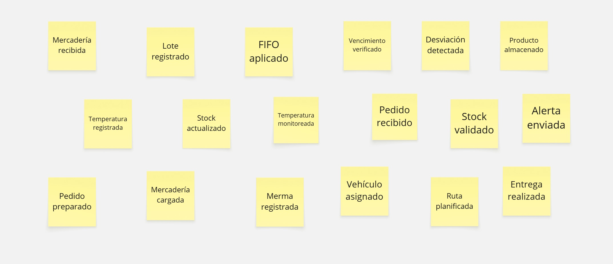
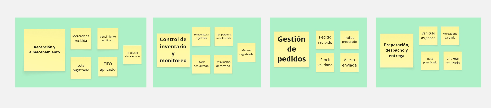

## 2.1 Competidores

En esta sección se identifican y describen los principales competidores que ofrecen soluciones digitales relacionadas con la gestión de inventarios, especialmente en el manejo de productos perecibles.

---

### Odoo

**Descripción:**  
Odoo es un software de código abierto que integra múltiples módulos empresariales, incluyendo gestión de inventarios, ventas y contabilidad.

**Modelo de negocio:**  
Funciona bajo un modelo *freemium*, donde ofrece una versión básica gratuita y módulos adicionales de pago bajo suscripción.

**Fortalezas:**
- Plataforma integral  
- Alta personalización  
- Amplia comunidad y soporte  

**Debilidades:**
- Puede ser complejo de implementar  
- Requiere capacitación para su uso completo  

---

### Reflex Solution

**Descripción:**  
Es una plataforma avanzada enfocada en la optimización de la cadena de suministros, especialmente en retail. Utiliza inteligencia artificial para mejorar la planificación de demanda y la gestión de inventarios.

**Modelo de negocio:**  
Software como servicio (*SaaS*) basado en suscripción empresarial.

**Fortalezas:**
- Uso de inteligencia artificial para predicción de demanda  
- Optimización de inventarios en tiempo real  
- Alta escalabilidad  

**Debilidades:**
- Alto costo  
- Enfocado principalmente en grandes empresas  

---

### Slim4

**Descripción:**  
Slim4 es una solución especializada en la optimización de inventarios y planificación de la cadena de suministro. Está diseñada para mejorar la disponibilidad de productos y reducir desperdicios.

**Modelo de negocio:**  
Software empresarial bajo licencia o suscripción.

**Fortalezas:**
- Enfoque especializado en inventarios  
- Reducción de sobrestock y quiebres  
- Análisis predictivo  

**Debilidades:**
- No es una solución integral como un ERP  
- Requiere integración con otros sistemas  

---

### Conclusión

Los competidores analizados presentan soluciones robustas orientadas a la gestión de inventarios, destacando principalmente en la automatización, análisis de datos y optimización de la cadena de suministro. Sin embargo, la mayoría de estas herramientas están orientadas a medianas y grandes empresas, lo que abre una oportunidad para desarrollar una solución más accesible, simple y enfocada en pequeñas empresas o distribuidoras locales de productos perecibles.

## 2.1.2 Estrategias y tácticas frente a competidores

Luego del análisis realizado, observamos que FreshKargo tiene una propuesta distinta frente a otras soluciones, sobre todo por su enfoque en productos perecibles y su adaptación a la realidad del mercado local. Con base en ello, se plantean estrategias concretas para reforzar sus fortalezas, corregir sus debilidades y responder mejor al entorno competitivo.

### Matriz CAME — Análisis FODA cruzado

|  | **Oportunidades** | **Amenazas** |
|---|---|---|
| **Fortalezas (F)**    1. Especialización en productos perecibles.   2. Conocimiento del mercado peruano.   3. Monitoreo en tiempo real, alertas y trazabilidad.   4. Acompañamiento directo al cliente. | **Estrategia FO — Ofensivas**    1. Aprovechar que muchas distribuidoras todavía trabajan de forma manual para presentar FreshKargo como una solución más específica para su realidad.   2. Resaltar funciones concretas como control de vencimientos, trazabilidad y alertas, ya que son aspectos que no siempre cubren los sistemas genéricos.   3. Ingresar primero a pequeñas y medianas empresas con una propuesta accesible y fácil de adoptar. | **Estrategia FA — Defensivas**    1. Diferenciarse de competidores más grandes mostrando que FreshKargo está hecho para perecibles y no para cualquier tipo de negocio.   2. Reforzar como ventaja el soporte cercano y el acompañamiento al cliente durante el uso del sistema.   3. Enfatizar que la propuesta no compite solo por precio, sino por adaptación al problema real del sector. |
| **Debilidades (D)**    1. Proyecto en etapa inicial.   2. Falta de casos implementados y documentados.   3. Menor reconocimiento frente a marcas ya posicionadas. | **Estrategia DO — Reorientación**    1. Realizar pilotos con distribuidoras pequeñas para obtener experiencia real y primeros resultados comprobables.   2. Usar esos primeros casos como respaldo para generar mayor confianza en nuevos clientes.   3. Aprovechar que el sector todavía tiene poca oferta especializada a nivel local para ganar espacio desde ahora. | **Estrategia DA — Supervivencia**    1. Evitar competir directamente con plataformas grandes que apuntan a empresas más complejas o de mayor escala.   2. Enfocarse en un nicho específico donde la especialización sí marque diferencia.   3. Reducir la desconfianza inicial con demostraciones, pruebas y acompañamiento constante. |

## 2.2 Entrevistas

### 2.2.1 Diseño de entrevistas

#### Segmento 1: Empresas distribuidoras de productos perecibles

**Datos del entrevistado**

1. ¿Cuál es su nombre y edad?
2. ¿En qué distrito opera su empresa actualmente?
3. ¿Cuál es su cargo o rol dentro de la empresa?
4. ¿En qué sector específico trabaja su empresa? (alimenticio, farmacéutico, agroindustrial, otro)
5. ¿Cuántos años lleva trabajando en el rubro logístico o de distribución?
6. ¿Cuántas personas conforman su equipo operativo actualmente?

**Gestión de inventario**

7. ¿Qué método utilizan actualmente para registrar y controlar el inventario de sus productos perecibles?
8. ¿Con qué frecuencia detectan pérdidas por productos vencidos o en mal estado?
9. ¿Qué tan actualizado se mantiene el stock en sus registros durante las operaciones diarias?
10. ¿Han tenido inconvenientes graves por errores en el registro del inventario? ¿Cómo los manejaron?

**Control de temperatura y cadena de frío**

11. ¿Cómo monitorean la temperatura durante el almacenamiento y el transporte de sus productos?
12. ¿Qué sucede operativamente cuando detectan un fallo en la cadena de frío?
13. ¿Qué tan difícil les resulta identificar mermas o pérdidas en tiempo real dentro del proceso?

**Logística y distribución**

14. ¿Qué herramientas o sistemas utilizan actualmente para planificar y ejecutar su distribución?
15. ¿Cómo realizan el seguimiento de los productos desde el almacén hasta el punto de entrega final?
16. ¿Qué tan eficiente consideran su proceso de distribución actual y en qué basan esa valoración?

**Impacto económico y operativo**

17. ¿Cuánto estiman que pierden mensualmente por fallas en almacenamiento, transporte o control de inventario?
18. ¿Cuál de estos factores afecta más su rentabilidad: gestión de inventario, transporte o control de calidad?
19. ¿Cómo repercuten estos problemas en la satisfacción de sus clientes?

**Disposición hacia una solución digital**

20. ¿Qué tan valioso sería para ustedes contar con visibilidad del stock en tiempo real?
21. ¿Qué importancia le darían a una herramienta que monitoree la temperatura de forma automática y continua?
22. ¿Estarían dispuestos a invertir en una solución que automatice su inventario y distribución? ¿Bajo qué condiciones?
23. ¿Qué funcionalidades serían indispensables en una plataforma de gestión logística como FreshKargo?

#### Segmento 2: Tiendas y bodegas con productos perecibles

**Datos del entrevistado**

1. ¿Cuál es su nombre y edad?
2. ¿En qué distrito se ubica su tienda o bodega?
3. ¿Cuántos años lleva gestionando su negocio?
4. ¿Qué tipo de productos perecibles comercializa principalmente?
5. ¿Cuántas personas trabajan en su negocio actualmente?
6. ¿Maneja un solo local o tiene más puntos de venta?

**Control de inventario**

7. ¿Cómo controlan actualmente el stock de sus productos perecibles?
8. ¿Registran las entradas y salidas de forma manual o cuentan con algún sistema digital?
9. ¿Qué tan actualizado suele estar su inventario durante un día normal de operación?
10. ¿Con qué frecuencia se quedan sin stock de productos de alta rotación?

**Fechas de vencimiento y pérdidas**

11. ¿Cómo controlan las fechas de vencimiento de sus productos actualmente?
12. ¿Con qué frecuencia tienen pérdidas por productos vencidos o deteriorados?
13. ¿Qué tipo de productos les generan mayor cantidad de pérdidas y a qué lo atribuyen?

**Organización y errores frecuentes**

14. ¿Qué dificultades enfrentan para mantener ordenado su almacén o área de stock?
15. ¿Qué errores ocurren con mayor frecuencia en el registro o control de su inventario?
16. ¿Qué consecuencias les trae no encontrar un producto rápidamente cuando un cliente lo solicita?

**Impacto en ventas y clientes**

17. ¿Han perdido ventas o clientes por problemas relacionados con una mala gestión del inventario?
18. ¿Cómo deciden actualmente cuándo y cuánto reponer de cada producto?

**Disposición hacia una solución digital**

19. ¿Les resultaría útil recibir alertas automáticas cuando un producto esté próximo a vencerse?
20. ¿Utilizarían una aplicación sencilla para gestionar su inventario desde el celular o computadora?
21. ¿Qué funciones priorizarían: alertas de vencimiento, reportes de ventas o control automático de stock?
22. ¿Cuánto estarían dispuestos a pagar mensualmente por una solución como FreshKargo?

### 2.2.2 Registro de entrevistas

En esta sección presentamos los registros de las entrevistas que hicimos para cada segmento objetivo de nuestra aplicación.

#### Segmento 1: Empresas distribuidoras de productos perecibles

* **Entrevista #1:**
    * **Nombre:** Jari
    * **Apellidos:** Hassan Syeda
    * **Edad:** 25 años
    * **Distrito:** San Luis
    * **Rol:** Jefe de Operaciones y Logística (Sector alimenticio)
    * **Evidencia:**  
      ****
    * **Video URL:**  
      [**Entrevista grabada – Microsoft Stream**](https://upcedupe-my.sharepoint.com/:v:/r/personal/u20241d811_upc_edu_pe/Documents/0410.mp4?csf=1&web=1&e=Cu6fO3&nav=eyJyZWZlcnJhbEluZm8iOnsicmVmZXJyYWxBcHAiOiJTdHJlYW1XZWJBcHAiLCJyZWZlcnJhbFZpZXciOiJTaGFyZURpYWxvZy1MaW5rIiwicmVmZXJyYWxBcHBQbGF0Zm9ybSI6IldlYiIsInJlZmVycmFsTW9kZSI6InZpZXcifX0%3D)
    * **Timing:** 0:40 - 10:57
    * **Resumen:**
        Jari Hassan es un profesional de 25 años que se desempeña como Jefe de Operaciones y Logística en una empresa del sector alimenticio con base en San Luis. Trabaja directamente con la distribución de productos perecibles, como lácteos, embutidos y carnes envasadas, por lo que conoce de cerca las exigencias que implica mantener la cadena de frío y el control del inventario en este tipo de operación.

        A partir de su experiencia, señala que uno de los principales problemas en su empresa es la **falta de visibilidad en tiempo real**, tanto del stock como de las condiciones de temperatura durante el transporte. Actualmente combinan un ERP tradicional con registros manuales en Excel, lo que genera desfases en la información, errores de inventario y pérdidas por productos vencidos o en mal estado. También menciona que, cuando ocurre una falla en ruta, muchas veces se enteran demasiado tarde y la mercadería termina en cuarentena o merma.

        Jari considera que una solución digital sí podría aportar valor real a su operación, siempre que sea práctica, intuitiva y rápida de implementar. Para él, las funciones más importantes serían:

        - Control de lotes con alertas de vencimiento
        - Trazabilidad de vehículos por GPS
        - Monitoreo térmico en vivo con notificaciones inmediatas

        Estas funcionalidades ayudarían a prevenir pérdidas, mejorar la distribución y tomar decisiones con mayor rapidez.

### 2.2.3 Análisis de entrevistas

El análisis de entrevistas permitió conocer de manera más cercana las necesidades y preocupaciones de los usuarios. Gracias a ello, fue posible identificar qué funciones serían realmente útiles dentro de la aplicación y qué aspectos debían priorizarse para mejorar la comunicación y el acceso a la información.

## 2.3 Needfinding

En esta etapa se buscó entender mejor las necesidades reales de los usuarios a partir de las entrevistas realizadas. Esto permitió identificar los principales problemas que enfrentan en su operación diaria y obtener información clave para orientar el desarrollo de una solución más útil y alineada a su realidad.

## 2.4 Big Picture Event Storming

### Step 1 – Free Exploration

En esta etapa inicial, el equipo se enfocó en identificar y recopilar todos los eventos relevantes del proceso operativo mediante una dinámica abierta de generación de ideas. No se priorizó el orden ni la estructura, sino la captura de situaciones reales que ocurren en la operación. El propósito fue obtener una visión general del negocio, representando sus actividades clave sin entrar aún en detalles técnicos o de implementación.

{ width=70% }

### Step 2 – Structured Organization

Después de identificar los eventos, estos se organizaron en flujos lógicos que representan las principales etapas de la operación de distribución de productos perecibles. Esto permitió ordenar mejor el proceso y entender con más claridad cómo se conectan las actividades, desde el ingreso de la mercadería hasta la entrega final. Además, ayudó a visualizar con mayor facilidad los momentos del proceso que más adelante podrían revisarse para encontrar oportunidades de mejora.

{ width=70% }
