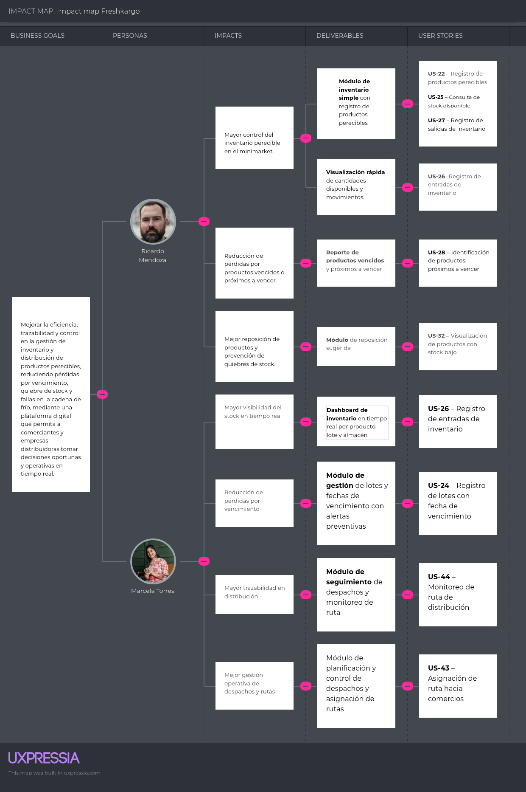

## 3.1. User Stories 
| Epic / Story ID | Título | Descripción | Criterios de Aceptación | Relacionado con (Epic ID) |
|----------------|--------|------------|--------------------------|---------------------------|
| EP01 | Landing page y captación de usuarios | Como visitante interesado en soluciones tecnológicas para la gestión de productos perecibles, quiere acceder a una landing page clara y estructurada, para comprender los beneficios del sistema y decidir registrarse. | Dado que el usuario accede al sitio web, cuando la página se carga correctamente, entonces el sistema muestra información clara del producto. | - |
| US-01 | Visualización de landing page | Como visitante que ingresa por primera vez, quiere visualizar una página clara y ordenada, para entender el propósito del sistema. | Escenario 1: Dado que el usuario accede a la URL principal, cuando el sistema responde correctamente, entonces se muestra la landing con contenido visible.   Escenario 2: Dado que ocurre un problema de conexión, cuando la página no carga correctamente, entonces el sistema muestra un mensaje de error. | EP01 |
| US-02 | Navegación entre secciones | Como visitante, quiere navegar entre secciones de la landing, para conocer mejor la plataforma. | Escenario 1: Dado que el usuario está en la landing, cuando selecciona una sección, entonces el sistema muestra el contenido correspondiente.   Escenario 2: Dado que el usuario intenta acceder a una sección inexistente, cuando realiza la acción, entonces el sistema muestra un mensaje informativo. | EP01 |
| US-03 | Visualización de beneficios | Como visitante, quiere visualizar beneficios del sistema, para entender su valor. | Escenario 1: Dado que el usuario accede a la sección de beneficios, cuando revisa el contenido, entonces el sistema muestra ventajas claras.   Escenario 2: Dado que no hay contenido disponible, cuando el usuario accede, entonces el sistema muestra un mensaje informativo. | EP01 |
| US-04 | Visualización de funcionalidades | Como visitante, quiere ver funcionalidades del sistema, para entender cómo funciona. | Escenario 1: Dado que el usuario accede a funcionalidades, cuando revisa la sección, entonces el sistema muestra características principales.   Escenario 2: Dado que ocurre un error de carga, cuando accede a la sección, entonces el sistema muestra un mensaje de error. | EP01 |
| US-05 | Acceso a registro | Como visitante, quiere acceder a registro desde la landing, para crear una cuenta fácilmente. | Escenario 1: Dado que el usuario está en la landing, cuando hace clic en registrarse, entonces el sistema redirige al formulario.   Escenario 2: Dado que ocurre un error en la redirección, cuando el usuario hace clic, entonces el sistema muestra un mensaje de error. | EP01 |
| US-06 | Diseño responsive | Como usuario, quiere ver la landing en cualquier dispositivo, para navegar sin problemas. | Escenario 1: Dado que el usuario accede desde móvil, cuando carga la página, entonces el sistema adapta el diseño.   Escenario 2: Dado que el dispositivo no es compatible, cuando accede, entonces el sistema muestra una versión optimizada. | EP01 |
| US-07 | Contacto | Como visitante, quiere contactar al equipo, para resolver dudas. | Escenario 1: Dado que el usuario completa el formulario, cuando envía el mensaje, entonces el sistema registra la consulta.   Escenario 2: Dado que el formulario está incompleto, cuando intenta enviarlo, entonces el sistema muestra errores de validación. | EP01 |
| EP02 | Registro y acceso de negocios | Como empresa, quiere registrarse e iniciar sesión, para acceder a las funcionalidades del sistema. | Dado que el usuario desea acceder al sistema, cuando completa el registro, entonces el sistema crea la cuenta. | - |
| US-08 | Registro de negocio | Como empresa, quiere registrarse con sus datos, para acceder al sistema. | Escenario 1: Dado que el usuario completa el formulario, cuando envía datos válidos, entonces el sistema crea la cuenta.   Escenario 2: Dado que el usuario ingresa datos inválidos, cuando intenta registrarse, entonces el sistema muestra errores. | EP02 |
| US-09 | Validación de datos | Como sistema, quiere validar datos, para evitar errores. | Escenario 1: Dado que el usuario ingresa datos incorrectos, cuando intenta registrarse, entonces el sistema bloquea el registro. | EP02 |
| US-10 | Inicio de sesión | Como usuario, quiere iniciar sesión, para acceder a su cuenta. | Escenario 1: Dado que el usuario ingresa credenciales válidas, cuando inicia sesión, entonces el sistema permite el acceso.   Escenario 2: Dado que las credenciales son incorrectas, cuando intenta ingresar, entonces el sistema muestra error. | EP02 |
| US-11 | Error de login | Como usuario, quiere recibir mensajes de error, para corregir datos. | Escenario 1: Dado que el usuario ingresa datos incorrectos, cuando intenta iniciar sesión, entonces el sistema muestra mensaje claro. | EP02 |
| US-12 | Recuperación de contraseña | Como usuario, quiere recuperar contraseña, para volver a acceder. | Escenario 1: Dado que el usuario solicita recuperación, cuando ingresa correo válido, entonces el sistema envía enlace.   Escenario 2: Dado que el correo no existe, cuando solicita recuperación, entonces el sistema muestra error. | EP02 |
| US-13 | Cierre de sesión | Como usuario, quiere cerrar sesión, para proteger su cuenta. | Escenario 1: Dado que el usuario está autenticado, cuando cierra sesión, entonces el sistema finaliza la sesión. | EP02 |
| US-14 | Persistencia de sesión | Como usuario, quiere mantener sesión activa, para evitar logins repetidos. | Escenario 1: Dado que el usuario ya inició sesión, cuando regresa, entonces el sistema mantiene sesión activa.   Escenario 2: Dado que la sesión expira, cuando intenta acceder, entonces el sistema solicita login nuevamente. | EP02 |
| EP03 | Gestión de usuarios y roles | Como administrador, quiere gestionar usuarios y roles, para controlar accesos en el sistema. | Dado que el administrador accede al sistema, cuando gestiona usuarios, entonces el sistema aplica cambios correctamente. | - |
| US-15 | Creación de usuarios | Como administrador, quiere crear usuarios, para permitir acceso. | Escenario 1: Dado que el admin ingresa datos válidos, cuando crea usuario, entonces el sistema lo registra.   Escenario 2: Dado que los datos son inválidos, cuando intenta crear usuario, entonces el sistema muestra error. | EP03 |
| US-16 | Asignación de roles | Como administrador, quiere asignar roles, para controlar permisos. | Escenario 1: Dado que el usuario existe, cuando se asigna un rol, entonces el sistema guarda el rol.   Escenario 2: Dado que el rol no existe, cuando se intenta asignar, entonces el sistema muestra error. | EP03 |
| US-17 | Edición de usuarios | Como administrador, quiere editar usuarios, para actualizar información. | Escenario 1: Dado que el usuario existe, cuando modifica datos válidos, entonces el sistema actualiza información.   Escenario 2: Dado que los datos son inválidos, cuando intenta guardar, entonces el sistema muestra error. | EP03 |
| US-18 | Eliminación de usuarios | Como administrador, quiere eliminar usuarios, para mantener orden. | Escenario 1: Dado que el usuario existe, cuando se elimina, entonces el sistema borra el registro.   Escenario 2: Dado que el usuario no existe, cuando intenta eliminarlo, entonces el sistema muestra error. | EP03 |
| US-19 | Restricción por roles | Como usuario, quiere acceso limitado, para evitar errores. | Escenario 1: Dado que el usuario tiene rol, cuando accede a función permitida, entonces el sistema permite acceso.   Escenario 2: Dado que intenta acceder a función restringida, cuando lo hace, entonces el sistema bloquea acceso. | EP03 |
| US-20 | Lista de usuarios | Como administrador, quiere ver usuarios, para gestionarlos. | Escenario 1: Dado que existen usuarios, cuando accede al módulo, entonces el sistema muestra la lista.   Escenario 2: Dado que no hay usuarios, cuando accede, entonces el sistema muestra mensaje informativo. | EP03 |
| US-21 | Cambio de roles | Como administrador, quiere modificar roles, para ajustar permisos. | Escenario 1: Dado que el usuario tiene rol, cuando se cambia, entonces el sistema actualiza el rol.   Escenario 2: Dado que ocurre un error, cuando intenta cambiar rol, entonces el sistema muestra mensaje de error. | EP03 |
| EP04 | Gestión de productos e inventario perecibles | Como empresa distribuidora o comercio minorista, quiero gestionar productos perecibles, lotes, fechas de vencimiento y stock disponible, para reducir pérdidas y mantener control del inventario. | N/A | N/A |
| US-22 | Registro de productos perecibles | Como encargado de inventario, quiero registrar productos perecibles con sus datos principales, para mantener actualizado el catálogo de productos del negocio. | Escenario 1: Registro exitoso de producto **Dado que** el encargado ingresa los datos válidos del producto **Cuando** confirma el registro **Entonces** el sistema guarda el producto en el inventario. | EP04 |
| US-23 | Edición de información de productos | Como encargado de inventario, quiero editar la información de un producto perecible, para corregir o actualizar sus datos cuando sea necesario. | Escenario 1: Actualización exitosa de producto **Dado que** el producto existe en el inventario **Cuando** el encargado modifica sus datos y guarda los cambios **Entonces** el sistema actualiza la información del producto. | EP04 |
| US-24 | Eliminación o desactivación de productos | Como encargado de inventario, quiero eliminar o desactivar productos que ya no se comercializan, para mantener el catálogo ordenado y vigente. | Escenario 1: Desactivación de producto **Dado que** el producto existe en el sistema **Cuando** el encargado confirma su desactivación **Entonces** el sistema retira el producto del catálogo activo. | EP04 |
| US-25 | Registro de lotes de productos | Como encargado de almacén, quiero registrar lotes de productos perecibles, para controlar su ingreso, vencimiento y trazabilidad. | Escenario 1: Registro exitoso de lote **Dado que** el producto existe en el inventario **Cuando** el encargado registra un lote con fecha de ingreso y vencimiento **Entonces** el sistema asocia el lote al producto correspondiente. | EP04 |
| US-26 | Visualización de stock disponible | Como encargado de inventario, quiero visualizar el stock disponible de cada producto, para tomar decisiones sobre ventas, despacho o reabastecimiento. | Escenario 1: Consulta de stock **Dado que** existen productos registrados **Cuando** el encargado accede al inventario **Entonces** el sistema muestra la cantidad disponible por producto y lote. | EP04 |
| US-27 | Alerta por vencimiento próximo | Como encargado de inventario, quiero recibir alertas de productos próximos a vencer, para priorizar su venta o despacho antes de generar pérdidas. | Escenario 1: Detección de vencimiento próximo **Dado que** un lote se encuentra cerca de su fecha de vencimiento **Cuando** el sistema verifica el inventario **Entonces** genera una alerta para informar el riesgo de vencimiento. | EP04 |
| US-28 | Control de merma de productos | Como encargado de almacén, quiero registrar productos vencidos o dañados como merma, para mantener el inventario real actualizado. | Escenario 1: Registro de merma **Dado que** un producto no se encuentra apto para su venta o despacho **Cuando** el encargado registra la merma **Entonces** el sistema descuenta la cantidad afectada del inventario disponible. | EP04 |
| EP05 | Control de reabastecimiento y proveedores | Como empresa distribuidora o comercio minorista, quiero controlar proveedores y necesidades de reabastecimiento, para asegurar disponibilidad de productos perecibles y evitar quiebres de stock. | N/A | N/A |
| US-29 | Registro de proveedores | Como encargado de compras, quiero registrar proveedores de productos perecibles, para mantener una base de datos organizada de abastecimiento. | Escenario 1: Registro exitoso de proveedor **Dado que** el encargado ingresa datos válidos del proveedor **Cuando** confirma el registro **Entonces** el sistema guarda al proveedor en la base de datos. | EP05 |
| US-30 | Edición de datos de proveedores | Como encargado de compras, quiero editar los datos de un proveedor, para mantener actualizada su información de contacto y abastecimiento. | Escenario 1: Actualización exitosa de proveedor **Dado que** el proveedor existe en el sistema **Cuando** el encargado modifica sus datos **Entonces** el sistema actualiza la información del proveedor. | EP05 |
| US-31 | Asociación de productos con proveedores | Como encargado de compras, quiero asociar productos perecibles a sus proveedores, para identificar quién abastece cada producto del inventario. | Escenario 1: Asociación exitosa **Dado que** existen productos y proveedores registrados **Cuando** el encargado vincula un producto con un proveedor **Entonces** el sistema guarda la relación de abastecimiento. | EP05 |
| US-32 | Definición de stock mínimo | Como encargado de inventario, quiero definir un stock mínimo para cada producto, para detectar cuándo se necesita reabastecimiento. | Escenario 1: Configuración de stock mínimo **Dado que** el producto existe en el inventario **Cuando** el encargado define una cantidad mínima **Entonces** el sistema guarda el umbral de reabastecimiento. | EP05 |
| US-33 | Alerta por bajo stock | Como encargado de compras, quiero recibir alertas cuando un producto llegue a stock mínimo, para solicitar reposición oportunamente. | Escenario 1: Detección de bajo stock **Dado que** un producto alcanza o baja su stock mínimo **Cuando** el sistema verifica el inventario **Entonces** genera una alerta de reabastecimiento. | EP05 |
| US-34 | Generación de solicitud de reabastecimiento | Como encargado de compras, quiero generar solicitudes de reabastecimiento, para pedir productos a los proveedores correspondientes. | Escenario 1: Solicitud generada correctamente **Dado que** existe una alerta de bajo stock **Cuando** el encargado genera la solicitud **Entonces** el sistema registra la solicitud de reabastecimiento. | EP05 |
| US-35 | Seguimiento de solicitudes a proveedores | Como encargado de compras, quiero consultar el estado de las solicitudes enviadas a proveedores, para saber si están pendientes, aprobadas o atendidas. | Escenario 1: Consulta de estado de solicitud **Dado que** existen solicitudes de reabastecimiento registradas **Cuando** el encargado revisa el módulo de solicitudes **Entonces** el sistema muestra el estado actualizado de cada solicitud. | EP05 |
| EP06 | Gestión de carga y despacho | Como empresa distribuidora, quiero gestionar la preparación de carga y despacho de productos perecibles, para asegurar entregas organizadas, trazables y en condiciones adecuadas. | N/A | N/A |
| US-36 | Creación de órdenes de despacho | Como encargado de logística, quiero crear órdenes de despacho, para organizar la salida de productos perecibles hacia los comercios. | Escenario 1: Creación exitosa de despacho **Dado que** existen productos disponibles en inventario **Cuando** el encargado genera una orden de despacho **Entonces** el sistema registra la orden con los productos seleccionados. | EP06 |
| US-37 | Selección de productos por lote para despacho | Como encargado de almacén, quiero seleccionar productos por lote para un despacho, para priorizar la salida de productos según vencimiento y disponibilidad. | Escenario 1: Selección de lote disponible **Dado que** existen lotes disponibles de un producto **Cuando** el encargado selecciona el lote para despacho **Entonces** el sistema lo vincula a la orden correspondiente. | EP06 |
| US-38 | Validación de stock antes del despacho | Como sistema, quiero validar el stock disponible antes de confirmar un despacho, para evitar preparar pedidos con cantidades insuficientes. | Escenario 1: Validación correcta de stock **Dado que** el encargado intenta confirmar una orden de despacho **Cuando** el sistema verifica las cantidades solicitadas **Entonces** permite confirmar la orden si el stock es suficiente. | EP06 |
| US-39 | Asignación de vehículo para despacho | Como encargado de logística, quiero asignar un vehículo a una orden de despacho, para organizar el transporte de la carga perecible. | Escenario 1: Asignación exitosa de vehículo **Dado que** existe una orden de despacho pendiente **Cuando** el encargado selecciona un vehículo disponible **Entonces** el sistema vincula el vehículo con la orden de despacho. | EP06 |
| US-40 | Asignación de transportista | Como encargado de logística, quiero asignar un transportista a una orden de despacho, para definir al responsable de la entrega. | Escenario 1: Asignación exitosa de transportista **Dado que** existe una orden de despacho programada **Cuando** el encargado selecciona un transportista disponible **Entonces** el sistema asigna al transportista como responsable del despacho. | EP06 |
| US-41 | Confirmación de salida de carga | Como encargado de almacén, quiero confirmar la salida de la carga, para registrar oficialmente que los productos salieron del almacén. | Escenario 1: Confirmación de salida **Dado que** la orden de despacho está preparada **Cuando** el encargado confirma la salida **Entonces** el sistema cambia el estado del despacho a “En tránsito”. | EP06 |
| US-42 | Consulta de despachos programados | Como encargado de logística, quiero visualizar los despachos programados, para monitorear qué cargas están pendientes, preparadas o en tránsito. | Escenario 1: Visualización de despachos **Dado que** existen órdenes de despacho registradas **Cuando** el encargado accede al módulo de despachos **Entonces** el sistema muestra la lista de despachos con su estado correspondiente. | EP06 |
| EP07 | Distribución y trazabilidad de despachos | Como empresa distribuidora, quiero gestionar el seguimiento del cargamento hasta el local del comerciante, para asegurar la visibilidad de la ruta y confirmar la entrega. | N/A | N/A |
| US-43 | Asignación de ruta hacia comercios | Como encargado de logística de una empresa distribuidora, quiero asignar una ruta y un vehículo a un despacho, para organizar la entrega diaria a los comerciantes. | Escenario 1: Asignación exitosa Dado que existe un despacho programado Cuando el encargado selecciona un vehículo disponible y confirma la ruta Entonces el sistema vincula el camión al despacho y notifica al transportista. | EP07 |
| US-44 | Monitoreo de ruta de distribución | Como gerente de operaciones de una distribuidora, quiero visualizar en un mapa la ubicación del camión, para asegurar que la mercadería perecible llegue a tiempo. | Escenario 1: Actualización de ubicación en tránsito Dado que el vehículo distribuidor está en movimiento Cuando el GPS emite una nueva coordenada Entonces el sistema actualiza la posición del marcador en el mapa. | EP07 |
| US-45 | Registro de llegada al comercio | Como transportista de una distribuidora, quiero registrar mi llegada al local del comerciante, para documentar el cumplimiento de los tiempos logísticos. | Escenario 1: Registro de llegada al destino Dado que el transportista llega al almacén del comerciante Cuando selecciona la opción "En punto de entrega" Entonces el sistema registra la hora exacta y notifica al receptor. | EP07 |
| US-46 | Prueba de entrega de productos (POD) | Como comerciante minorista, quiero firmar digitalmente la recepción de la carga, para dejar constancia de que los productos llegaron en las condiciones acordadas. | Escenario 1: Registro de conformidad Dado que la carga ha sido descargada Cuando el comerciante firma en la aplicación del transportista Entonces el sistema guarda la firma y cambia el estado a "Entregado". | EP07 |
| US-47 | Registro de rechazo de mercadería | Como comerciante mayorista, quiero poder registrar el rechazo de productos que llegaron dañados, para que la distribuidora gestione la nota de crédito. | Escenario 1: Rechazo parcial de la carga Dado que el comerciante inspecciona los productos Cuando marca un lote como "Dañado/Rechazado" en el sistema Entonces el despacho se actualiza con una incidencia y notifica a la distribuidora. | EP07 |
| US-48 | Reasignación por rechazo total | Como encargado de logística de una distribuidora, quiero reasignar el retorno de un despacho rechazado totalmente, para devolverlo al almacén de mermas. | Escenario 1: Retorno a base Dado que un comerciante rechaza la totalidad del despacho Cuando el transportista confirma el rechazo en la aplicación Entonces el sistema genera una ruta de retorno automático al almacén principal. | EP07 |
| US-49 | Historial de despachos recibidos | Como comerciante minorista, quiero visualizar un historial de todos los despachos recibidos, para conciliar mis facturas con la distribuidora. | Escenario 1: Consulta de entregas mensuales Dado que el comerciante ha recibido múltiples pedidos Cuando ingresa a la sección de "Historial de Recepciones" Entonces el sistema muestra una lista con fechas, productos y estado de cada entrega. | EP07 |
| EP08 | Alertas, notificaciones y monitoreo de condiciones | Como actor de la cadena de suministro, quiero vigilar la cadena de frío, para recibir avisos inmediatos ante anomalías que pongan en riesgo los productos perecibles. | N/A | N/A |
| US-50 | Verificación de cadena de frío | Como comerciante mayorista, quiero ver las métricas de temperatura del camión antes de descargar, para asegurar la calidad de los productos. | Escenario 1: Lectura de condiciones de llegada Dado que el camión de la distribuidora llega al local Cuando el comerciante revisa el enlace de seguimiento Entonces el sistema muestra los indicadores térmicos en rango óptimo. | EP08 |
| US-51 | Alerta de riesgo térmico en ruta | Como monitor de calidad de una distribuidora, quiero recibir una alerta si la temperatura excede los límites, para evitar mermas antes de llegar al minorista. | Escenario 1: Detección de temperatura fuera de rango Dado que la carga perecible está en tránsito Cuando el sistema recibe 3 lecturas superiores al límite máximo Entonces genera una alerta crítica y envía un SMS al transportista. | EP08 |
| US-52 | Notificación de proximidad al local | Como comerciante minorista, quiero recibir un aviso cuando el camión distribuidor esté cerca, para preparar mi almacén frigorífico. | Escenario 1: Aviso por cercanía al comercio Dado que el camión está en tránsito Cuando el GPS detecta que está a menos de 5 kilómetros del comercio Entonces el sistema envía una alerta de próxima llegada. | EP08 |
| US-53 | Alerta por pérdida de telemetría | Como empresa distribuidora, quiero saber si un sensor pierde señal, para evitar puntos ciegos en la cadena de frío. | Escenario 1: Desconexión prolongada Dado que un despacho de distribución está activo Cuando no se recibe telemetría durante más de 15 minutos Entonces el sistema activa una alerta de "Pérdida de Conexión". | EP08 |
| US-54 | Reporte diario de incidencias térmicas | Como gerente de operaciones de una distribuidora, quiero recibir un reporte automático diario con rupturas de frío, para evaluar el desempeño de la flota. | Escenario 1: Generación de reporte de fin de jornada Dado que finaliza la ruta de distribución Cuando el sistema consolida las alertas del día Entonces envía un reporte en PDF al correo del gerente de operaciones. | EP08 |
| US-55 | Alerta de mantenimiento frigorífico | Como coordinador de flota de una distribuidora, quiero recibir una alerta si un vehículo presenta variaciones térmicas constantes. | Escenario 1: Patrón de falla detectado Dado que un camión ha completado sus rutas de la semana Cuando el sistema detecta fluctuaciones térmicas en más del 30% de sus viajes Entonces genera una alerta de mantenimiento sugerido. | EP08 |
| US-56 | Notificación de merma al comerciante | Como comerciante mayorista, quiero recibir una notificación si mi pedido sufrió una ruptura de frío confirmada en ruta. | Escenario 1: Aviso preventivo de daño Dado que el monitor de la distribuidora confirma una falla irreparable de frío Cuando el sistema marca el despacho como "Merma en ruta" Entonces se envía un correo al mayorista avisando la cancelación y reprogramación del pedido. | EP08 |
| EP09 | Technical stories del RESTful API e integraciones | Como developer, quiero disponer de endpoints para conectar los sistemas de las distribuidoras y los ERP de los comerciantes. | N/A | N/A |
| US-57 | Autenticación de sistemas B2B | Como developer de una distribuidora, quiero enviar credenciales al API para obtener un token JWT, para integrar nuestro ERP de forma segura. | Escenario 1: Generación de Token B2B Dado que el sistema externo envía un POST a `/api/v1/auth` Cuando el servidor valida los accesos corporativos Entonces el API responde con código `200 OK` y el token JWT. | EP09 |
| US-58 | Ingesta continua de telemetría | Como developer de una distribuidora, quiero ingestar datos de temperatura desde los camiones, para mantener el historial térmico actualizado. | Escenario 1: Registro masivo de condiciones Dado que el dispositivo IoT recopila datos térmicos Cuando envía un POST a `/api/v1/telemetry` con el payload JSON Entonces el API valida la estructura y responde con `201 Created`. | EP09 |
| US-59 | Sincronización de trazabilidad | Como developer de un comerciante mayorista, quiero consultar el estado de un despacho vía API, para verlo directamente en nuestro propio ERP. | Escenario 1: Petición de trazabilidad externa Dado que el ERP del comerciante envía un GET a `/api/v1/despachos/{id}/trazabilidad` Cuando el ID de despacho es válido Entonces el API responde con código `200 OK` y el historial de progreso. | EP09 |
| US-60 | Webhooks de alertas para comercios | Como developer, quiero configurar webhooks para que los sistemas de la distribuidora y mayorista reciban notificaciones automáticas ante fallas térmicas. | Escenario 1: Disparo de webhook por alerta térmica Dado que se registra una alerta crítica de temperatura Cuando existe una URL del comerciante suscrita Entonces el API dispara un POST hacia su sistema con los detalles. | EP09 |
| US-61 | Descarga de Prueba de Entrega (POD) | Como developer de un comerciante mayorista, quiero descargar el comprobante de entrega firmado vía API. | Escenario 1: Descarga exitosa de documento POD Dado que el despacho tiene estado "Entregado" Cuando el sistema envía un GET a `/api/v1/despachos/{id}/pod` Entonces el API responde con código `200 OK` y el documento PDF de respaldo. | EP09 |
| US-62 | Sincronización de catálogo perecible | Como developer de un comerciante minorista, quiero consumir el catálogo de productos disponibles vía API. | Escenario 1: Petición de catálogo actualizado Dado que la distribuidora actualiza su inventario de perecibles Cuando el sistema del minorista envía un GET a `/api/v1/productos` Entonces el API responde con código `200 OK` y la lista de productos disponibles. | EP09 |
| US-63 | Envío de reclamo vía API | Como developer de un comerciante mayorista, quiero enviar un ticket de reclamo por mercadería dañada a través del API. | Escenario 1: Registro remoto de incidencia Dado que el mayorista detecta mercadería en mal estado Cuando su ERP envía un POST a `/api/v1/despachos/{id}/reclamos` con la evidencia adjunta Entonces el API crea el ticket en el sistema de la distribuidora y retorna código `201 Created`. | EP09 |

## 3.1. Impact Mapping

## 3.2. Product Backlog 

El Product Backlog de FreshKargo organiza y prioriza las historias de usuario identificadas para el desarrollo del producto. La priorización considera el valor de negocio, la dependencia funcional y la importancia de cada historia dentro del flujo principal del sistema. En primer lugar, se ubican las historias relacionadas con el acceso, la autenticación y la gestión de usuarios, ya que permiten el uso seguro de la plataforma. Luego, se priorizan las funcionalidades núcleo del negocio, como la gestión del inventario perecible, el control de reabastecimiento y la administración de despachos. Finalmente, se consideran las historias orientadas a trazabilidad, monitoreo de cadena de frío, captación comercial e integraciones técnicas.

Los Story Points fueron estimados en una escala de **1, 2, 3, 5 y 8**, donde los valores más altos representan mayor complejidad técnica, esfuerzo de desarrollo o dependencia con otros componentes del sistema.

| # Orden | User Story Id | Título | Descripción | Story Points (1 / 2 / 3 / 5 / 8) |
|:---:|:---:|---|---|:---:|
| 1 | US-08 | Registro de negocio | Como empresa, quiere registrarse con sus datos, para acceder al sistema. | 3 |
| 2 | US-09 | Validación de datos | Como sistema, quiere validar datos, para evitar errores. | 2 |
| 3 | US-10 | Inicio de sesión | Como usuario, quiere iniciar sesión, para acceder a su cuenta. | 3 |
| 4 | US-11 | Error de login | Como usuario, quiere recibir mensajes de error, para corregir datos. | 1 |
| 5 | US-12 | Recuperación de contraseña | Como usuario, quiere recuperar contraseña, para volver a acceder. | 3 |
| 6 | US-13 | Cierre de sesión | Como usuario, quiere cerrar sesión, para proteger su cuenta. | 1 |
| 7 | US-14 | Persistencia de sesión | Como usuario, quiere mantener sesión activa, para evitar logins repetidos. | 3 |
| 8 | US-15 | Creación de usuarios | Como administrador, quiere crear usuarios, para permitir acceso. | 3 |
| 9 | US-16 | Asignación de roles | Como administrador, quiere asignar roles, para controlar permisos. | 2 |
| 10 | US-17 | Edición de usuarios | Como administrador, quiere editar usuarios, para actualizar información. | 3 |
| 11 | US-18 | Eliminación de usuarios | Como administrador, quiere eliminar usuarios, para mantener orden. | 2 |
| 12 | US-19 | Restricción por roles | Como usuario, quiere acceso limitado, para evitar errores. | 3 |
| 13 | US-20 | Lista de usuarios | Como administrador, quiere ver usuarios, para gestionarlos. | 2 |
| 14 | US-21 | Cambio de roles | Como administrador, quiere modificar roles, para ajustar permisos. | 2 |
| 15 | US-22 | Registro de productos perecibles | Como encargado de almacén de una empresa distribuidora de productos perecibles, quiere registrar productos con información básica, para mantener un catálogo organizado dentro de FreshKargo. | 3 |
| 16 | US-23 | Edición de información de productos | Como administrador de un minimarket, quiere actualizar la información de sus productos perecibles, para mantener correctos sus datos. | 2 |
| 17 | US-24 | Registro de lotes con fecha de vencimiento | Como encargado de almacén de una empresa distribuidora de productos perecibles, quiere registrar lotes con fecha de ingreso, fecha de vencimiento y cantidad disponible, para controlar la vida útil de la mercadería. | 5 |
| 18 | US-25 | Consulta de stock disponible | Como dueño de un minimarket, quiere consultar el stock disponible por producto, para saber qué mercadería puede vender, reponer o retirar antes de que genere pérdidas. | 2 |
| 19 | US-26 | Registro de entradas de inventario | Como encargado de almacén de una empresa distribuidora, quiere registrar la entrada de nuevos productos o lotes, para mantener actualizado el inventario digital frente al inventario físico. | 3 |
| 20 | US-27 | Registro de salidas de inventario | Como administrador de un minimarket, quiere registrar salidas de productos por venta, devolución o merma, para mantener actualizado el stock real del negocio. | 3 |
| 21 | US-28 | Identificación de productos próximos a vencer | Como empresa distribuidora de productos perecibles, quiere identificar productos próximos a vencer, para priorizar su salida, promoción o retiro antes de que se conviertan en merma. | 3 |
| 22 | US-29 | Registro de proveedores | Como responsable de compras de una empresa distribuidora de productos perecibles, quiere registrar proveedores con sus datos de contacto y productos ofrecidos, para organizar las fuentes de abastecimiento del negocio. | 3 |
| 23 | US-30 | Edición de datos de proveedores | Como administrador de un minimarket, quiere actualizar los datos de sus proveedores, para mantener vigente la información de contacto, condiciones de entrega y productos que ofrecen. | 2 |
| 24 | US-31 | Asociación de productos con proveedores | Como responsable de compras de una empresa distribuidora, quiere asociar productos perecibles con sus proveedores, para identificar rápidamente a quién solicitar reabastecimiento cuando el stock sea bajo. | 3 |
| 25 | US-32 | Visualización de productos con stock bajo | Como dueño de un minimarket, quiere visualizar productos con stock bajo, para planificar compras antes de quedarse sin mercadería disponible para la venta. | 2 |
| 26 | US-33 | Generación de solicitud de reabastecimiento | Como responsable de compras de una empresa distribuidora, quiere generar solicitudes de reabastecimiento para productos con stock bajo, para iniciar el proceso de compra con el proveedor correspondiente. | 5 |
| 27 | US-34 | Consulta de historial de reabastecimiento | Como administrador de negocio, quiere consultar el historial de solicitudes de reabastecimiento, para revisar compras anteriores y evaluar la frecuencia de reposición de productos. | 2 |
| 28 | US-35 | Priorización de productos para reabastecimiento | Como comercio minorista, quiere priorizar los productos que deben reabastecerse según stock bajo y demanda reciente, para comprar primero la mercadería más necesaria. | 5 |
| 29 | US-36 | Creación de orden de despacho | Como jefe de operaciones logísticas de una empresa distribuidora de productos perecibles, quiere crear órdenes de despacho asociando productos, lotes, cantidades y destino, para organizar la salida de mercadería desde el almacén. | 5 |
| 30 | US-37 | Selección de lotes para despacho | Como encargado de almacén de una empresa distribuidora, quiere seleccionar los lotes que serán enviados en un despacho, para priorizar productos próximos a vencer y reducir pérdidas por caducidad. | 3 |
| 31 | US-38 | Asignación de carga para distribución | Como responsable de despacho de una empresa distribuidora, quiere asignar productos y lotes a una carga de distribución, para preparar correctamente la mercadería antes de su salida del almacén. | 5 |
| 32 | US-39 | Asignación de responsable de despacho | Como jefe de operaciones logísticas de una empresa distribuidora, quiere asignar un responsable a cada despacho, para tener trazabilidad interna sobre quién prepara y supervisa la salida de productos. | 2 |
| 33 | US-40 | Confirmación de salida de carga | Como responsable de despacho de una empresa distribuidora, quiere confirmar la salida de una carga, para registrar oficialmente que los productos salieron del almacén hacia su destino. | 2 |
| 34 | US-41 | Consulta de estado de preparación de despacho | Como jefe de operaciones logísticas de una empresa distribuidora, quiere consultar el estado de preparación de cada despacho, para saber si una carga está pendiente, completa o lista para salir. | 2 |
| 35 | US-42 | Validación de productos antes del despacho | Como responsable de despacho de una empresa distribuidora, quiere validar los productos antes de su salida, para confirmar que las cantidades, lotes y condiciones coinciden con la orden de despacho. | 5 |
| 36 | US-43 | Asignación de ruta hacia comercios | Como encargado de logística de una empresa distribuidora, quiere asignar una ruta y un vehículo a un despacho, para organizar la entrega diaria a los comerciantes. | 3 |
| 37 | US-44 | Monitoreo de ruta de distribución | Como gerente de operaciones de una distribuidora, quiere visualizar en un mapa la ubicación del camión, para asegurar que la mercadería perecible llegue a tiempo. | 8 |
| 38 | US-45 | Registro de llegada al comercio | Como transportista de una distribuidora, quiere registrar su llegada al local del comerciante, para documentar el cumplimiento de los tiempos logísticos. | 2 |
| 39 | US-46 | Prueba de entrega de productos (POD) | Como comerciante minorista, quiere firmar digitalmente la recepción de la carga, para dejar constancia de que los productos llegaron en las condiciones acordadas. | 3 |
| 40 | US-47 | Registro de rechazo de mercadería | Como comerciante mayorista, quiere poder registrar el rechazo de productos que llegaron dañados, para que la distribuidora gestione la nota de crédito. | 3 |
| 41 | US-48 | Reasignación por rechazo total | Como encargado de logística de una distribuidora, quiere reasignar el retorno de un despacho rechazado totalmente, para devolverlo al almacén de mermas. | 5 |
| 42 | US-49 | Historial de despachos recibidos | Como comerciante minorista, quiere visualizar un historial de todos los despachos recibidos, para conciliar sus facturas con la distribuidora. | 2 |
| 43 | US-50 | Verificación de cadena de frío | Como comerciante mayorista, quiere ver las métricas de temperatura del camión antes de descargar, para asegurar la calidad de los productos. | 3 |
| 44 | US-51 | Alerta de riesgo térmico en ruta | Como monitor de calidad de una distribuidora, quiere recibir una alerta si la temperatura excede los límites, para evitar mermas antes de llegar al minorista. | 5 |
| 45 | US-52 | Notificación de proximidad al local | Como comerciante minorista, quiere recibir un aviso cuando el camión distribuidor esté cerca, para preparar su almacén frigorífico. | 3 |
| 46 | US-53 | Alerta por pérdida de telemetría | Como empresa distribuidora, quiere saber si un sensor pierde señal, para evitar puntos ciegos en la cadena de frío. | 5 |
| 47 | US-54 | Reporte diario de incidencias térmicas | Como gerente de operaciones de una distribuidora, quiere recibir un reporte automático diario con rupturas de frío, para evaluar el desempeño de la flota. | 3 |
| 48 | US-55 | Alerta de mantenimiento frigorífico | Como coordinador de flota de una distribuidora, quiere recibir una alerta si un vehículo presenta variaciones térmicas constantes. | 5 |
| 49 | US-56 | Notificación de merma al comerciante | Como comerciante mayorista, quiere recibir una notificación si su pedido sufrió una ruptura de frío confirmada en ruta. | 2 |
| 50 | US-01 | Visualización de landing page | Como visitante que ingresa por primera vez, quiere visualizar una página clara y ordenada, para entender el propósito del sistema. | 2 |
| 51 | US-02 | Navegación entre secciones | Como visitante, quiere navegar entre secciones de la landing, para conocer mejor la plataforma. | 2 |
| 52 | US-03 | Visualización de beneficios | Como visitante, quiere visualizar beneficios del sistema, para entender su valor. | 1 |
| 53 | US-04 | Visualización de funcionalidades | Como visitante, quiere ver funcionalidades del sistema, para entender cómo funciona. | 1 |
| 54 | US-05 | Acceso a registro | Como visitante, quiere acceder a registro desde la landing, para crear una cuenta fácilmente. | 2 |
| 55 | US-06 | Diseño responsive | Como usuario, quiere ver la landing en cualquier dispositivo, para navegar sin problemas. | 3 |
| 56 | US-07 | Contacto | Como visitante, quiere contactar al equipo, para resolver dudas. | 2 |
| 57 | US-57 | Autenticación de sistemas B2B | Como developer de una distribuidora, quiere enviar credenciales al API para obtener un token JWT, para integrar su ERP de forma segura. | 5 |
| 58 | US-58 | Ingesta continua de telemetría | Como developer de una distribuidora, quiere ingestar datos de temperatura desde los camiones, para mantener el historial térmico actualizado. | 8 |
| 59 | US-59 | Sincronización de trazabilidad | Como developer de un comerciante mayorista, quiere consultar el estado de un despacho vía API, para verlo directamente en su propio ERP. | 5 |
| 60 | US-60 | Webhooks de alertas para comercios | Como developer, quiere configurar webhooks para que los sistemas de la distribuidora y mayorista reciban notificaciones automáticas ante fallas térmicas. | 8 |
| 61 | US-61 | Descarga de Prueba de Entrega (POD) | Como developer de un comerciante mayorista, quiere descargar el comprobante de entrega firmado vía API. | 5 |
| 62 | US-62 | Sincronización de catálogo perecible | Como developer de un comerciante minorista, quiere consumir el catálogo de productos disponibles vía API. | 5 |
| 63 | US-63 | Envío de reclamo vía API | Como developer de un comerciante mayorista, quiere enviar un ticket de reclamo por mercadería dañada a través del API. | 5 |