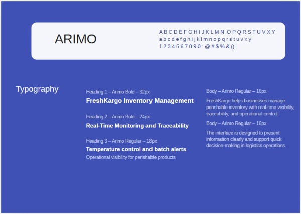
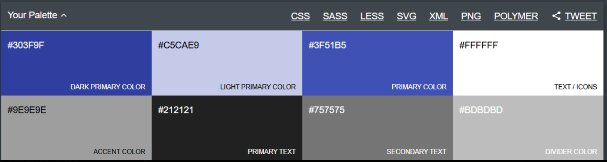
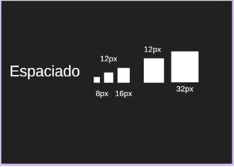
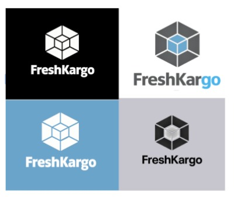
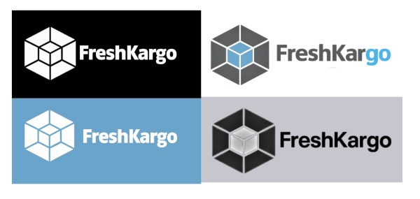
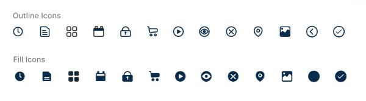
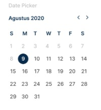
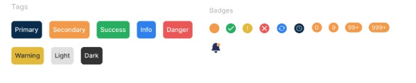
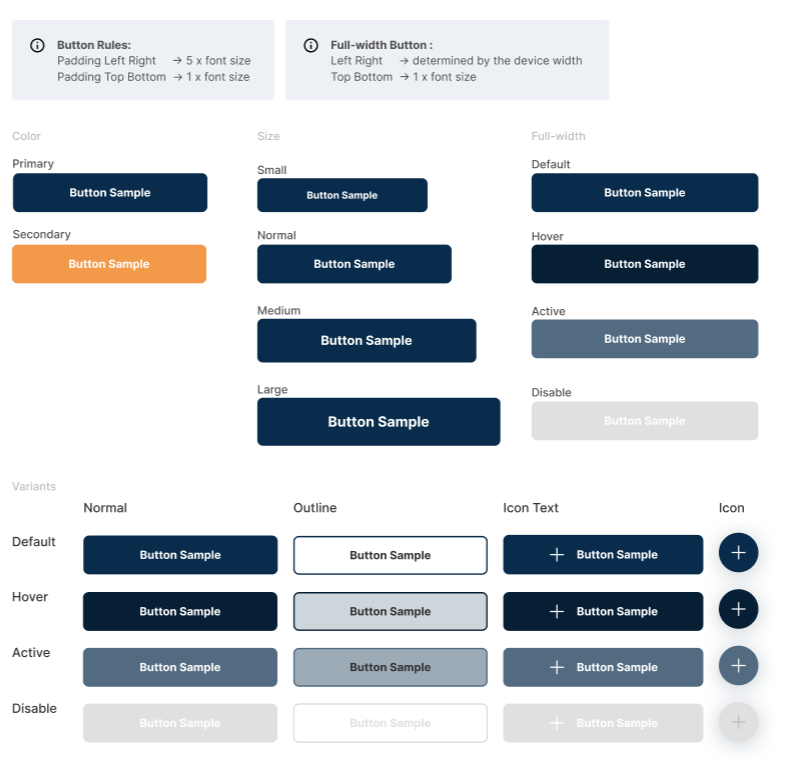

# Capítulo IV: Product Design

## 4.1. Style Guidelines

### 4.1.1. General Style Guidelines

Las siguientes pautas de estilo han sido diseñadas para garantizar la coherencia visual y comunicativa de 
FreshKargo, una plataforma orientada a la gestión de inventarios y distribución de productos perecibles. 
Estas pautas buscan asegurar una experiencia intuitiva, clara y confiable para los usuarios, especialmente 
en contextos donde el control en tiempo real, la trazabilidad y la reducción de pérdidas son factores clave.

## Tipografía
* **Fuente:** Arimo
* **Tamaños:** Seleccionar entre los tamaños disponibles para asegurar una legibilidad adecuada en diferentes 
dispositivos y tamaños de pantalla.
* **Estilos:** Utilizar estilos como negrita o cursiva para resaltar información importante.
Espaciado entre letras y líneas: Ajustar según sea necesario para mejorar la legibilidad, especialmente en textos 
largos.

## Colores principales
* **Dark Primary Color – #303F9F** → Utilizado en encabezados, elementos destacados y componentes con mayor 
peso visual.
* **Light Primary Color – #C5CAE9** → Aplicado en fondos suaves, tarjetas o secciones secundarias.
* **Primary Color – #3F51B5** → Color principal para botones, enlaces y elementos interactivos.
* **Text / Icons – #FFFFFF** → Usado en textos o íconos sobre fondos oscuros o de color principal.

## Colores neutros y utilitarios
* **Accent Color – #9E9E9E** → Empleado en detalles secundarios y elementos de apoyo visual.
* **Primary Text – #212121** → Color principal para textos informativos y contenido de lectura.
* **Secondary Text – #757575** → Aplicado en textos complementarios o de menor jerarquía.
* **Divider Color – #BDBDBD** → Utilizado en bordes, separadores y líneas divisorias.

## Significado y uso
La paleta de FreshKargo combina tonos azules y grises para transmitir confianza, organización, tecnología y 
profesionalismo. Los azules refuerzan la identidad digital del producto y su enfoque en el monitoreo y control 
en tiempo real, mientras que los tonos neutros ayudan a mantener una interfaz limpia, equilibrada y fácil de usar.

## Espaciado
* **Espaciado entre componentes:** Utilizar un sistema de espaciado basado en medidas regulares, como 8 px, 12 px, 16 px,
24 px y 32 px, para asegurar una distribución visual equilibrada y ordenada entre botones, tarjetas, formularios, 
tablas y bloques de contenido.
* **Consistencia visual:** Estas pautas de espaciado deben aplicarse de manera uniforme en toda la plataforma para 
mantener una interfaz clara, organizada y fácil de usar, especialmente en procesos de monitoreo, control y 
trazabilidad de productos perecibles.

## Escritura
* **Claridad comunicativa:** Implementar un estilo de redacción directo y comprensible que permita al usuario entender
rápidamente la información más importante dentro de la plataforma.
* **Accesibilidad lingüística:** Evitar tecnicismos innecesarios o expresiones demasiado complejas, para que la 
información sea fácil de interpretar por distintos tipos de usuarios, desde operadores logísticos hasta 
responsables de tienda.
* **Uniformidad tonal:** Mantener un estilo de comunicación homogéneo en toda la aplicación, transmitiendo orden,
confianza y soporte en la toma de decisiones.
* **Enfoque funcional:** Priorizar mensajes breves, precisos y orientados a la acción, especialmente en alertas, 
notificaciones, estados de inventario y seguimiento de incidencias.

## Branding
FreshKargo se representa mediante un logotipo geométrico y modular que transmite orden, control y organización. 
Su forma está compuesta por bloques conectados, lo que refleja la idea de una operación logística estructurada y
bien integrada.

El bloque central en color azul simboliza tecnología, confianza y monitoreo en tiempo real, mientras que las 
piezas grises representan estabilidad y soporte dentro del sistema. En conjunto, el logo comunica una plataforma 
orientada a la gestión de inventario, la trazabilidad y la conectividad de procesos.

La identidad visual de FreshKargo busca proyectar una imagen moderna, clara y funcional, alineada con una solución
digital enfocada en productos perecibles.

A partir de este concepto central, se desarrollaron distintas variaciones cromáticas del logotipo de FreshKargo
que se adaptan a diferentes contextos de comunicación:

* **Versión en blanco sobre fondo negro:** Utiliza el blanco para el símbolo y el texto, generando un contraste 
fuerte y una apariencia sobria. Esta versión transmite solidez, orden y una identidad visual clara, ideal para
presentaciones o piezas donde se busca mayor impacto.
* **Versión a color sobre fondo claro:** Mantiene el gris en la estructura externa y el azul en el bloque central, 
resaltando el equilibrio entre organización y tecnología. El gris representa estructura y soporte logístico,
mientras que el azul simboliza monitoreo, visibilidad y confianza en tiempo real.
* **Versión en blanco sobre fondo azul:** Refuerza la relación de la marca con tecnología, control y conectividad.
El uso del blanco sobre azul permite destacar el logotipo con claridad y proyecta una imagen moderna y funcional
dentro de entornos digitales.
* **Versión monocromática sobre fondo neutro:** Simplifica la identidad visual del logotipo manteniendo su forma 
geométrica esencial. Esta variación comunica sobriedad, consistencia y versatilidad, siendo útil para 
aplicaciones más formales o materiales donde se requiere una presentación visual más limpia de la marca.

La identidad visual de FreshKargo es versátil y mantiene coherencia en sus diferentes usos. Su logotipo, de forma 
geométrica y modular, transmite orden, control y conexión entre procesos. Gracias a sus variaciones cromáticas, 
la marca puede adaptarse a distintos contextos sin perder su esencia: una solución tecnológica enfocada en la 
trazabilidad, el monitoreo y la gestión eficiente de productos perecibles.

Los valores que representa son:

* Organización
* Conectividad
* Control
* Precisión
* Confianza

### 4.1.2. Web Style Guide

En esta sección se presentan las pautas visuales que definen la identidad de la interfaz web de FreshKargo. 
Estas guías permiten mantener coherencia en el diseño, mejorar la usabilidad y asegurar una experiencia clara
para los usuarios que gestionan productos perecibles.

## Iconography
* **Icon sets :**

## Selectors
El calendario es una función importante dentro de FreshKargo porque permite registrar, consultar y organizar 
información vinculada a fechas clave en la operación. **En el Segmento 1**, resulta útil para registrar fechas de 
vencimiento, programar despachos, controlar entregas y hacer seguimiento de lotes, ya que las entrevistas muestran
problemas de desfase entre el stock real y el registrado, además de pérdidas por productos vencidos o fallas
detectadas tarde. También se valora la necesidad de alertas de vencimiento, monitoreo en tiempo real y 
confirmación digital de entregas.
**En el Segmento 2**, el selector de fecha también aporta valor porque ayuda a registrar el ingreso de productos,
revisar fechas de reposición y llevar un mejor control del estado de frutas y vegetales en tienda. Esto reduce la
dependencia del registro manual y facilita que el usuario pueda ordenar mejor sus tareas sin tener que revisar
todo físicamente o estar presente todo el tiempo en el local.

## Small Elements

## Buttons

